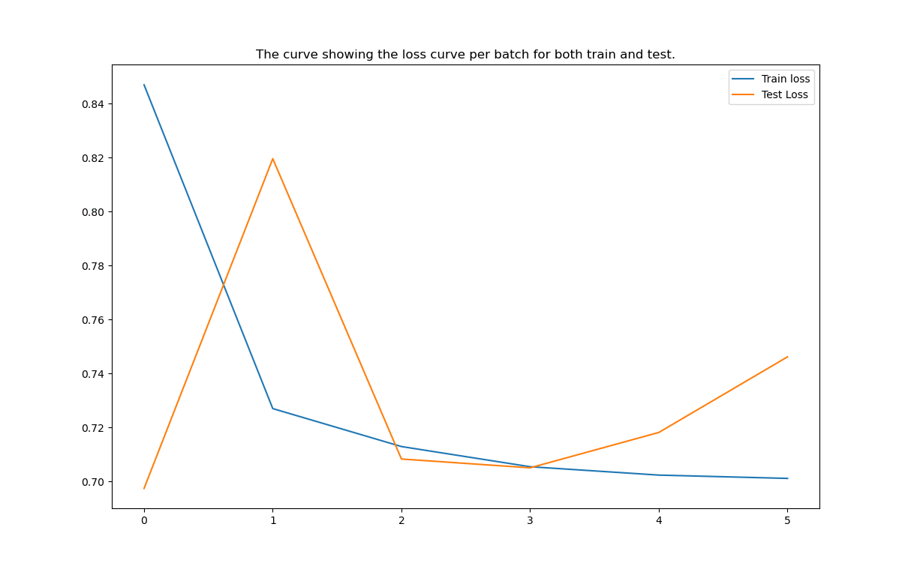
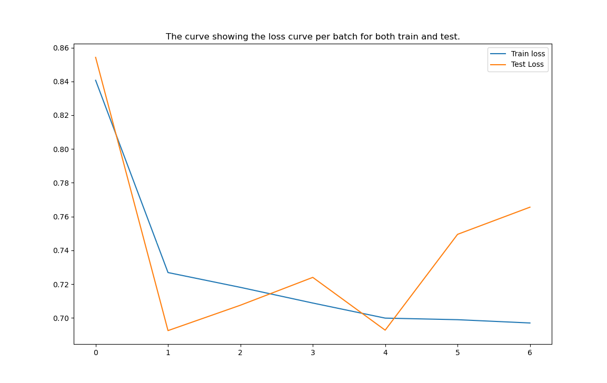

<center> <h1>Project Beta-Lactamase</h1> </center>

This is the project inspired from [Data Professor](https://www.youtube.com/channel/UCV8e2g4IWQqK71bbzGDEI4Q), from this [Call of Papers video](https://www.youtube.com/watch?v=_GtEgiWWyK4), and I started to contruibute with all my approaches. This project is very much interestng as this is related to bio-informatics, as well as machine learning. The whole structure of the project is look like this:


 

```
Beta Lactamase 
          |
          |_______ IPYNB
          |_______ code
          |_______ Data_professor_Dir
          |_______ src
                  |_____ dataset.py
                  |_____ utils.py
                  |_____ models.py
                  |_____ CONFIG.py
                  |_____ train.py
      
```
1. The `IPYNB` dir contains visualization and analysis of the dataset and preprocessing steps.
2. The `dataset.py` in the `src` folder contains the code to convert simple smiles molecules into tensor graphs, which is based upon rdkit objects.
3. Similarly `utils.py` contains some utility functions to make our code more modular and easy to read.
4. `CONFIG.py` contains the different configurations required to tweek the model. 
5. Finally `train.py` contains the training and evaluation of the model.

## Updates of work done till now:
Till now, the dataprerocessing part, a detailed analysis is been done on the dataset, and is also converted successfully into small moecular graphs which is are compatible with PyTorch Geometric. Intial works also contains developing a simple base line model that provides us some baseline regression results. The best result in test dataset by the model till now is the MSE loss of 0.69. But my aim is to optimize more. 

These are some results of our model which are captured during training. 
 

As we can see that after 2 epochs the model is trying to get overfitted, so applied early stop and conditional model state saving based on the improvement of the metrics has also been implemented.

## Future updates in this works:
The possible future pipeline of this project could be:
1. Making a model which will be much robust and efficient than the baseline and will perform regression and potential classification based task at the same time.
2. Modularising the whole code base.
3. Transforming this code base to a webapp dashboard where user can upload anyform molecule information, and our model will do the rest of the stuff.
4. Improving the documentation.

