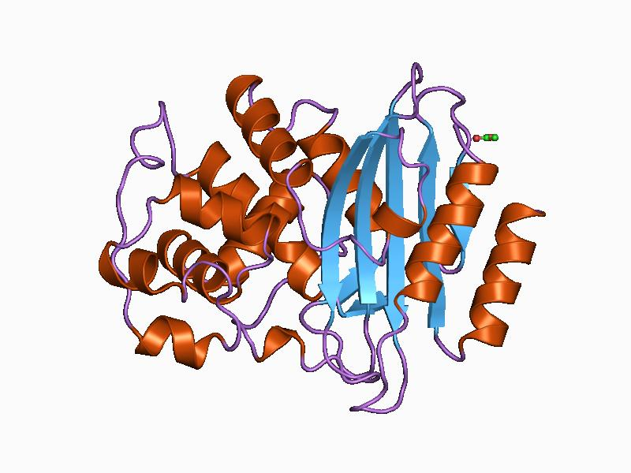

<center> <h1>Project Beta-Lactamase</h1> </center>

This is the project inspired from [Data Professor](https://www.youtube.com/channel/UCV8e2g4IWQqK71bbzGDEI4Q) sir, from this [Call of Papers video](https://www.youtube.com/watch?v=_GtEgiWWyK4), and I started to contruibute with all my approaches. This project is very much interestng as this is related to bio-informatics, as well as machine learning. Being a aspirant in Graph ML in generals and GNNs in particular, I wanted to contribute in this project based on all my approaches. The whole structure of the project is look like this:


 

```
Beta Lactamase 
          |
          |_______ IPYNB
          |_______ code
          |_______ Data_professor_Dir
          |_______ src
```

In the `IPYNB` dir there will all my approaches, from feature engineering to building the whole pipeline in doing the regression tasks of predicting the pchembl_value as well as  several SSL tasks and generative tasks. Those tasks include mainly genetative tasks of molecules geneations as well as downstream tasks of node classification, Graph Clustering, etc. The `code` dir contains the finalised tasks based on approaches made in the IPYNB files. and `Data_Professor_dir`, is the dir that contains the starter files and data as per his video. The `Data` dir is the dir containing the dataset used in the zip format provided by Data Professor sir. 


## Updates of work done till now:


